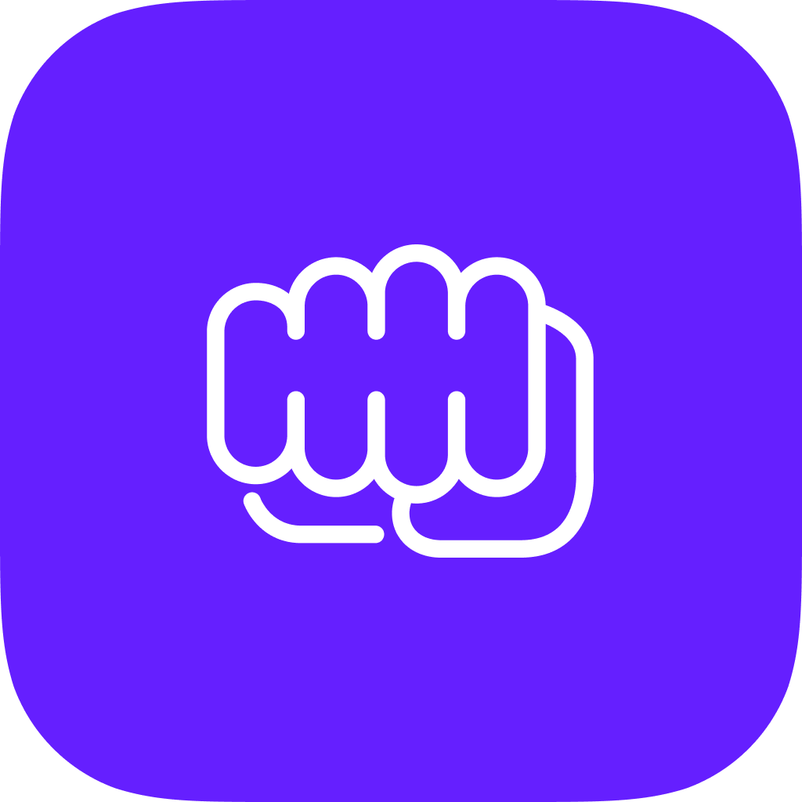
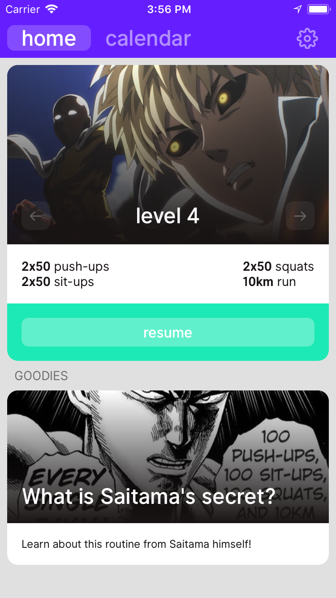
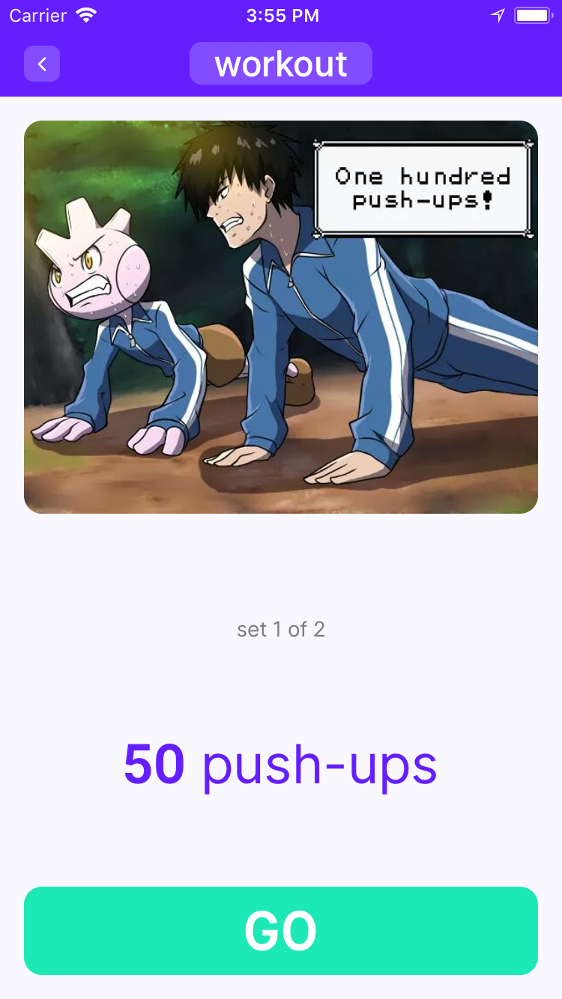
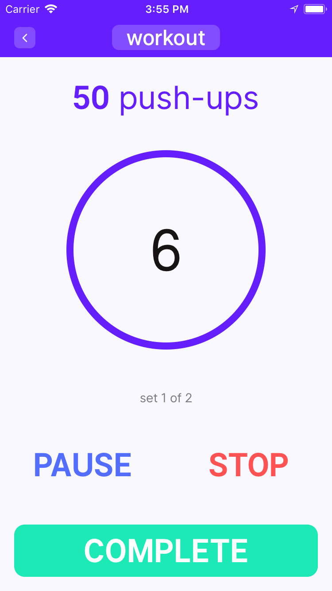
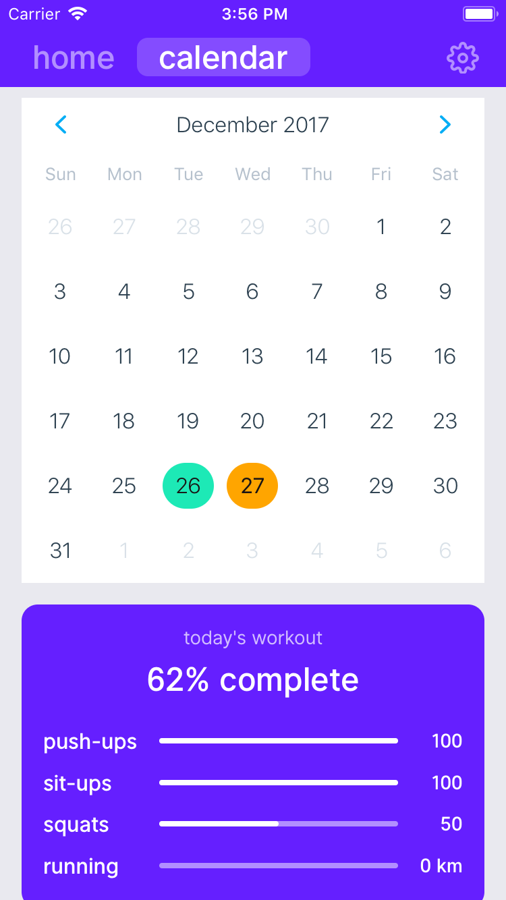
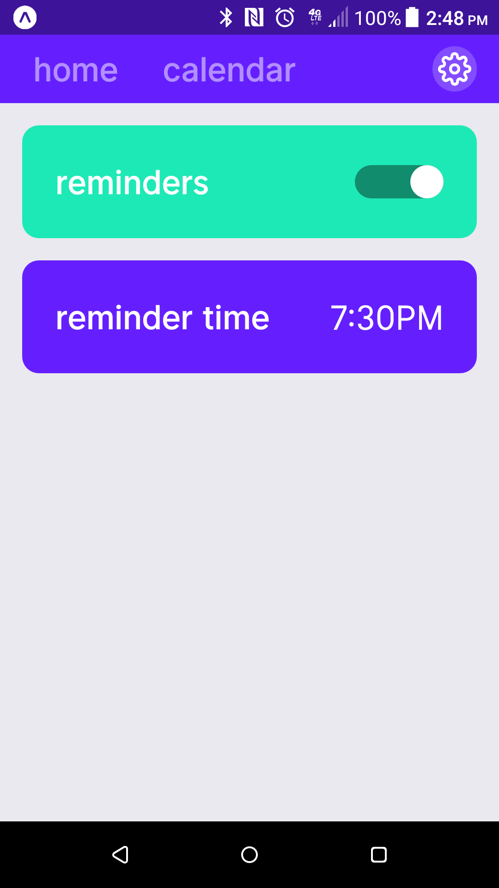

  

<h3 align="center" style="font-weight:600">
  One Punch Fitness
</h3>

  A "One Punch Man"-inspired workout app!

---

[Get it on Expo!](https://expo.io/@datwheat/one-punch-fitness)

## Screenshots

  
  
  
  
  

## Key technologies used to build this

* [Expo](https://expo.io/)
* [ReasonML](https://reasonml.github.io/)
* [ReasonReact](https://reasonml.github.io/reason-react/) +
  [Reductive](https://github.com/reasonml-community/reductive)
* [styled-components](https://www.styled-components.com/)
* [React Navigation](https://reactnavigation.org/)
* [Figma](https://www.figma.com/) (for design)
