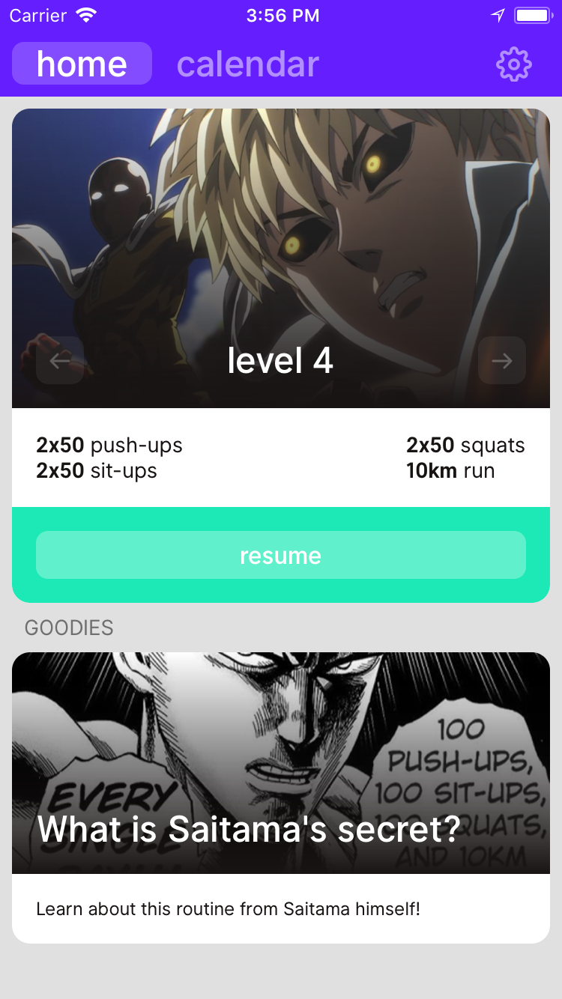
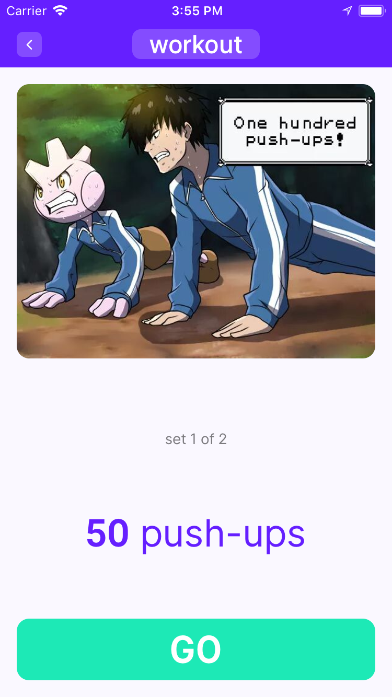
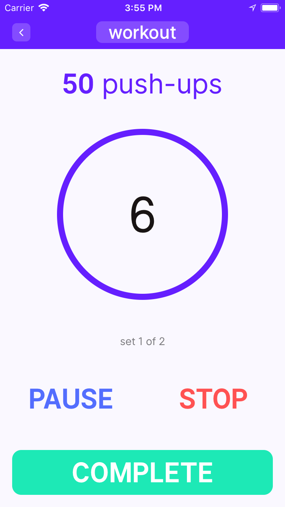
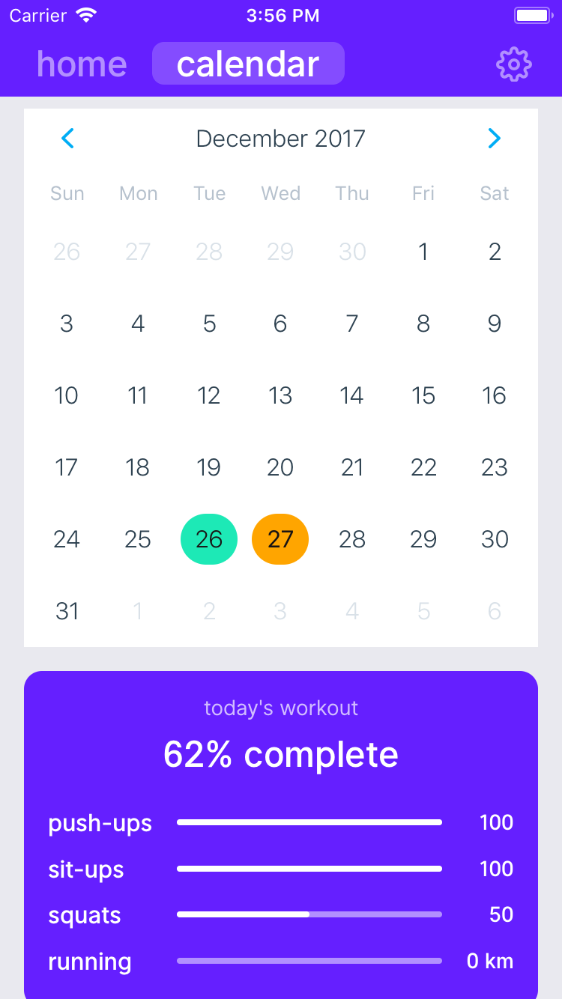
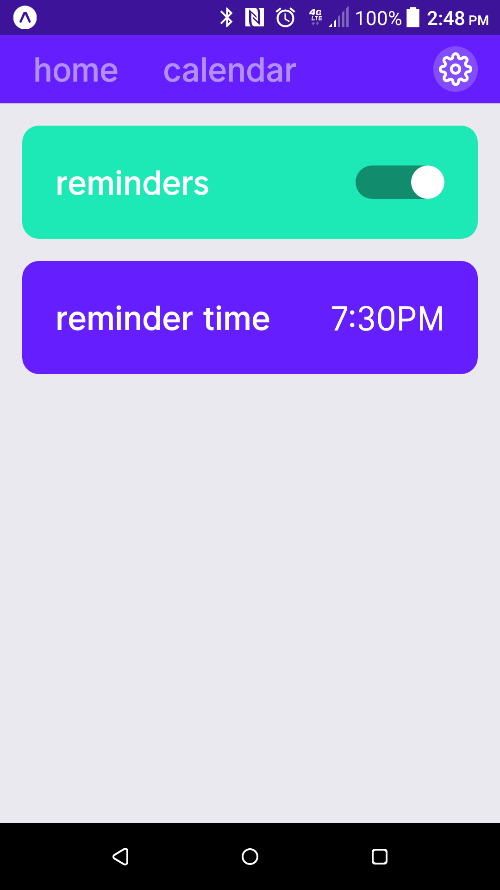

<p align="center">
  
</p>

<h3 align="center" style="font-weight:600">
  One Punch Fitness
</h3>

<p align="center">
  A "One Punch Man"-inspired workout app: 100 push-ups, 100 sit-ups, 100 squats,
  and a 10km run — every single day. Pick one of five intensity levels, work
  through each exercise on a timer, and track your streak on the calendar.
</p>

## Screenshots

<p align="center">
  
  
  
  
  
</p>

## Development

```sh
npm install      # install dependencies
npx expo start   # start the dev server
```

Then press `i` / `a` to open the iOS simulator or Android emulator, or scan the
QR code with a development build.

### Scripts

```sh
npm run lint       # eslint (eslint-config-expo), zero warnings tolerated
npm run typecheck  # tsc --noEmit (strict)
```

## Built with

- [Expo SDK 57](https://expo.dev/) + [React Native](https://reactnative.dev/)
- [Expo Router](https://docs.expo.dev/router/introduction/) (typed routes, native tabs)
- [TypeScript](https://www.typescriptlang.org/) (strict)
- [Zustand](https://github.com/pmndrs/zustand) + AsyncStorage for persistence
