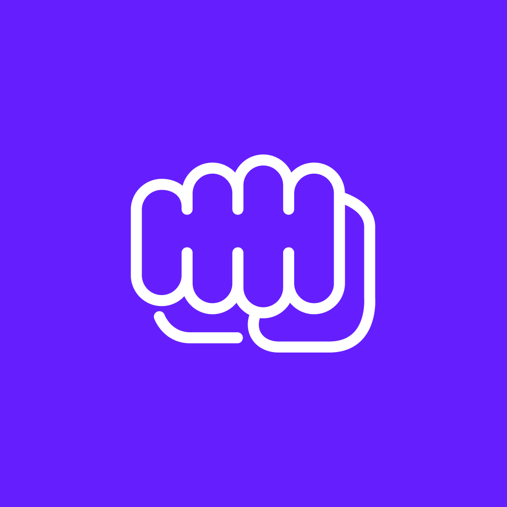

  

<h2 align="center" style="font-weight:600">
  One Punch Fitness
</h2>

  A "One Punch Man"-inspired workout app!

---

[Get it on Expo!](https://expo.io/@datwheat/one-punch-fitness)

## Screenshots

  
  
  
  
  

## Key technologies used to build this

* Expo
* React Native
* ReasonML
* Reductive
* styled-components
* react-navigation
* Figma (for design)
